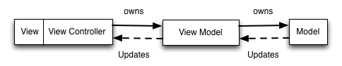

## Summary

Assets app is built on Xcode 12.5 swift 5.4, and using carthage as dependencies manager

## Prerequisites

  - Before you bootstrap, it's you responsibility to run `./bootstrap.sh` via `Terminal`. this command will install following tools:
    - [brew](https://brew.sh/)
      - the missing package manager for macOS
    - [fastlane](https://docs.fastlane.tools)
      - fastlane is the easiest way to automate beta deployments and releases for your iOS and Android apps. 🚀 It handles all tedious tasks, like generating screenshots, dealing with code signing, and releasing your application
    - [carthage](https://github.com/Carthage/Carthage)
      - Carthage is intended to be the simplest way to add frameworks to your Cocoa application.
      - Carthage builds your dependencies and provides you with binary frameworks, but you retain full control over your project structure and setup. Carthage does not automatically modify your project files or your build settings.
    - [swiftlint](https://github.com/realm/SwiftLint)
      - A tool to enforce Swift style and conventions, loosely based on the now archived [GitHub Swift Style Guide](https://github.com/github/swift-style-guide) . SwiftLint enforces the style guide rules that are generally accepted by the Swift community. These rules are well described in popular style guides like [Ray Wenderlich's Swift Style Guide](https://github.com/raywenderlich/swift-style-guide).
    - [swiftgen](https://github.com/SwiftGen/SwiftGen)
      - SwiftGen is a tool to automatically generate Swift code for resources of your projects (like images, localised strings, etc), to make them type-safe to use.
      - There are multiple benefits in using this:
        - Avoid any risk of typo when using a String
        - Free auto-completion
        - Avoid the risk of using a non-existing asset name
        - All this will be ensured by the compiler and thus avoid the risk of crashing at runtime.

      Also, it's fully customizable thanks to Stencil templates, so even if it comes with predefined templates, you can make your own to generate whatever code fits your needs and your guidelines!
    - [swiftformat](https://github.com/nicklockwood/SwiftFormat)
      - SwiftFormat is a code library and command-line tool for reformatting Swift code on macOS or Linux.

      - SwiftFormat goes above and beyond what you might expect from a code formatter. In addition to adjusting white space it can insert or remove implicit self, remove redundant parentheses, and correct many other deviations from the standard Swift idioms.
    - [sourcery](https://github.com/krzysztofzablocki/Sourcery)
      - Sourcery is a code generator for Swift language, built on top of Apple's own SwiftSyntax. It extends the language abstractions to allow you to generate boilerplate code automatically.

## Fetch Dependencies
After all tools installed, you should do the following steps to fetch dependencies

```bash
$ cd path/to/SRCROOT
$ carthage update --use-xcframeworks
```
After carthage install excuted successfully you can now open the Xcode to run the project

## App structure
 - **Assets** using [MVVM](https://objccn.io/issue-13-1/) archtiecture as bellow
   


### ViewController

 - **BaseViewController**
   - in order to handler some **base&common** features, all controllers must inhert from **BaseViewController** expect some container controllers

    **e.g:** UITabBarController and UINavigationController.

   - The propuse of this contoller will provide some base or common features for all the controllers
 - **BaseTableViewController**
   - all the controllers which has list features, should be inhert from **BaseTableViewController**
   - this controller provide some list related features make it easy&less code to write when you need list features

### ViewModel
 - **BaseViewModel**
   - all ViewModel must inhert from BaseViewModel, this **BaseViewModel** provide lots of base features

 - **ListViewModel**
   - all list related ViewModel should inhert from this **ListViewModel** provide
   lots of list related beheiver


## Beta
Assets is used `fastlane` to upload the bate version ipa automatically to [pgyer](https://www.pgyer.com/)

You can run `fastlane beta` command via terminal, it will buld and upload you app automatically to [pgyer](https://www.pgyer.com/).

refrence [fastlane](#fastlane) for details


### fastlane
  - **CHANGELOG.MD**

    file content will be upload to pgyer as release note

## CHANGELOG
  All notable changes to this project must be documented in the CHANGELOG.md file
